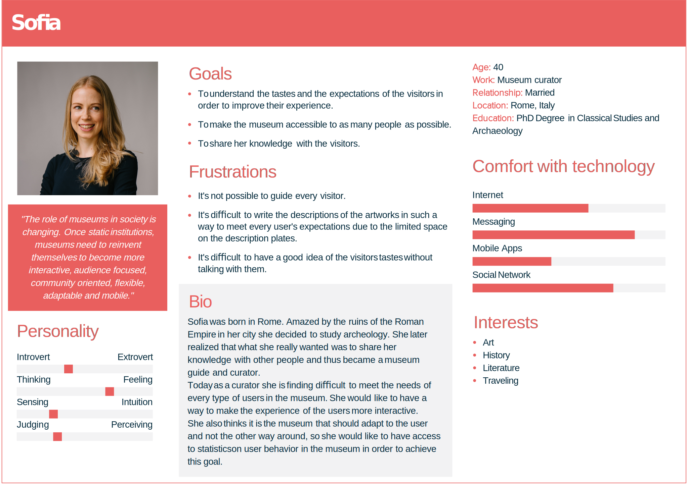
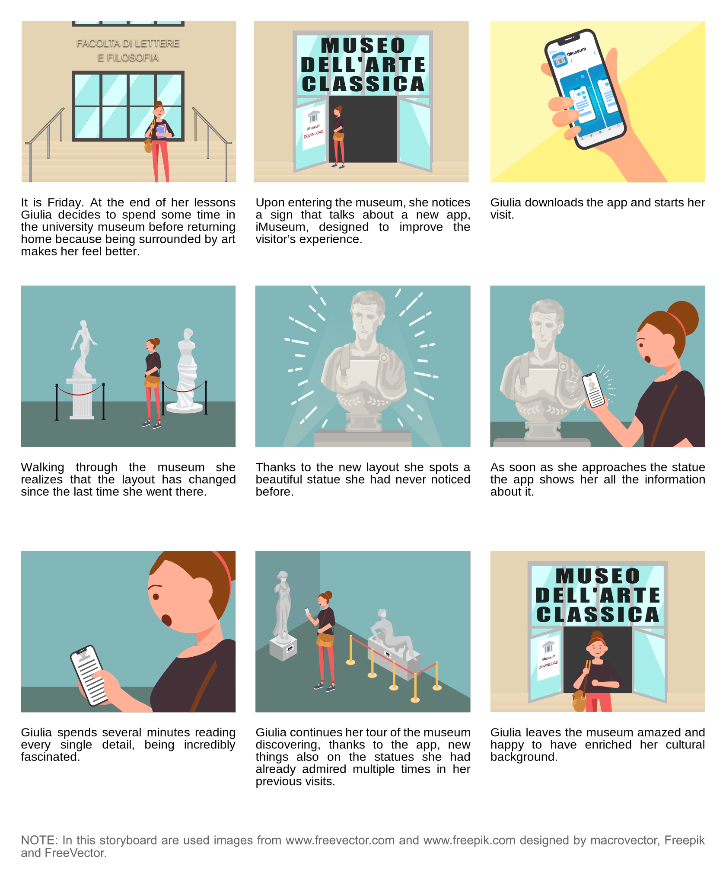

# Design

This document describes the design process of the product, illustrates the functionalities offered, defines the target users through the use of personas and shows the interaction between the users and the product using storyboards.

## Design process
The design process started with a video call with the curators of the Museum of classical Art of Sapienza-University of Rome. The information collected during the call was used to design the curator persona. From the call, it was understood that the curators wanted to make the museum more inclusive and wanted a way to better understand their users in order to meet their desires.

Another important detail received was the type of users of the museum, in particular, the curators said that most of the visitors are students of Bachelor/Master of Arts courses. Based on that it was decided to interview some real and some potential users of the museum, primarily B.A. and M.A. students. During the interviews, it was noticed that most of the interviewees said that they would like an easy and interactive way to access more detailed information about the artworks (even academic level information like articles and researches) and that the layout of most museums, the Sapienza's one included, isn't optimal. In particular, they said that the thematic disposition of the artworks used in most museums, while it has its benefits, it has the downside of potentially creating sections of the museums that are less interesting and other more interesting sections where there are a lot of people, making it difficult to see the artworks. For this reason, they said that it has happened a lot of times that they missed some artworks in their first visits, especially in museums were the pieces are very close due to the lack of space, like in the Sapienza's one.

The information collected during this phase was used to define the functionalities described in the next section.

## Functionalities

By downloading the iMuseum app on their smartphones the visitors of the museum can quickly access information about the art pieces on display.
When a user approaches an artwork, the app automatically shows the data about it.

In particular, the app will provide to the users three "tiers" of information:

- **Quick overview**: basic information about the artwork;

- **Complete description**: a complete description of both the cast replica and the original artwork together with information about the author of the replica and the original author (if known);

- **Academic**: academic level information like articles and researches about the pice of art.

On the other side, by accessing the web dashboard, the curators will have access to various statistics about the visitors' behavior like most viewed art pieces, average time spent in front of an artwork, heat-maps of the users' positions inside the museum and favorite routes. This will allow the curators to optimize the disposition of the artworks in the museum. The website will also inform the curators if any of the Bluetooth beacons it's not working properly.

# Users personas
We designed two personas representing the two categories of users of our product, the visitors and the curators.

### Visitor persona

### Curator persona

# Storyboards
The following storyboards illustrate the interaction of the visitors and of the curators with the product, showing how it can improve the experience of the firsts and the work of the seconds.

### Visitor storyboard

### Curator storyboard

