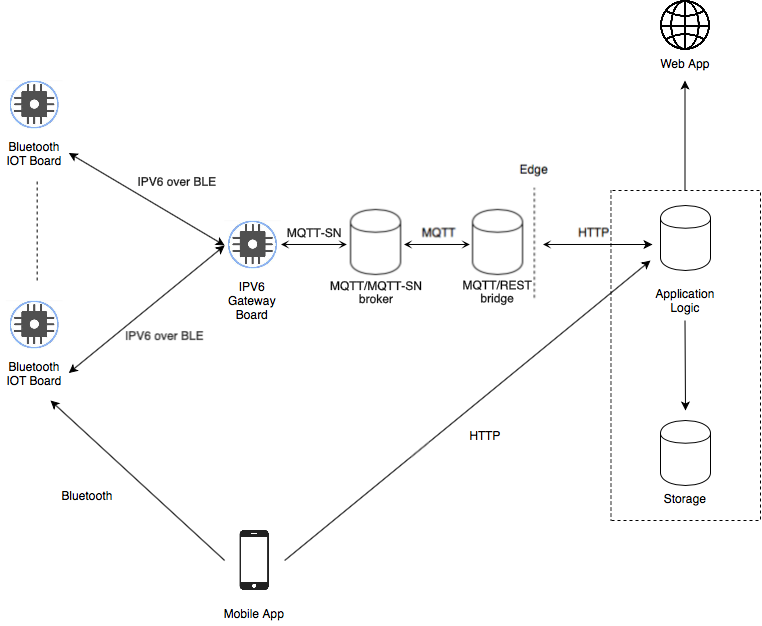

# Introduction and System Description

iMuseum is an IOT system to enhance the experience for a visitor in a museum: it uses IOT devices placed on each art piece to provide information to the user through a mobile app using the Bluetooth beacon mode.
The system also provides to the curator of the museum/exhibition a record of all the visits along with the path and the pieces seen inside the museum, and all the information about the status of the sensors, to help notify the maintenance about possible malfunctions.

# iMuseum Architecture
Here is shown a visual representation of the system’s architecture:

Starting from the right we have a variable number of IOT boards (one on each piece) that communicate with a mobile app using the Bluetooth beacon mode: once a visitor comes near a piece, the mobile application will provide a comprehensive list of information about the piece.
The boards communicate also with the cloud to provide information about their status (used for maintenance) and to receive updates about the opening hours of the museum in order to go in sleep mode when it is closed.
The communication works in this way: in each museum there is an IPV6 gateway board acting as the border router for the sensor network, it allows the boards to connect to the internet using the IPV6 over BLE protocol. This board is connected over USB to a computer which itself is connected to the internet, the connection is extended to the board using the ethos (ethernet over serial) protocol. On this computer run two pieces of software, the RSMB MQTT/MQTT-SN broker and an MQTT to REST bridge, allowing the messages from the boards to finally come over HTTP to the Application Logic tier through REST endpoints.

## Bluetooth IOT Board
The Bluetooth IOT board is in charge of beaming data using the Bluetooth beacon mode, providing an identifier of the piece where it’s placed. It also communicates to the IPv6 gateway through the IPv6 over BLE protocol.
The software for the board is based on RIOT OS and uses the NimBLE library for Bluetooth communication.
The board with a Bluetooth radio that is best supported by RIOT OS and NimBLE is the nRF52DK (https://www.nordicsemi.com/Software-and-Tools/Development-Kits/nRF52-DK).

## IPv6 Gateway Board
The IPv6 gateway board receives all the information from the sensor network of the museum and forwards them to the internet and vice versa.
It uses the RIOT OS GRNC border router software (https://github.com/RIOT-OS/RIOT/tree/master/examples/gnrc_border_router).
This too is an nRF52DK board.

## Smartphone (Mobile App)
The visitor will use a mobile app on his/her smartphone (it can either run iOS or Android) to obtain the identifier of a piece using Bluetooth that will be used to obtain all the related information from the cloud structure.
The app is developed using the Xamarin framework for multiplatform mobile app development.

## Bridge computer
This can be any Linux based computer, even something as cheap and simple as a Raspberry Pi Zero (https://www.raspberrypi.org/products/raspberry-pi-zero/).
It runs the RSMB MQTT/MQTT-SN broker and a python script acting as an MQTT to REST bridge to allow the boards to communicate with the cloud.

## Application Logic
The Application Logic tier is in charge to handle all the requests coming via REST protocol, mainly to all the resources/data inside the storage.
It’s deployed inside the firebase cloud infrastructure (https://firebase.google.com).

## Storage
The storage is in charge of the persistence of the data about the sensors' status, visitors' identities, pieces images, pieces documents, etc...
This too is deployed inside the FCI (https://firebase.google.com).

## Web App
The web app allows the curators to manage the system, bind the beacons to the relative artwork, add and update the information about them, set the opening hours of the museum, access the collected data about the visits, and check the status of the boards.
It is a javascript web app developed using the React Web framework.

# Software Components

## RIOT OS
It's an operating system used as a base to write firmware for a variety of embedded boards in C language (https://www.riot-os.org).

## Xamarin Forms
It's a framework that translates C# (OOP Language) at runtime to a native mobile device (can either be iOS or Android) (https://docs.microsoft.com/it-it/xamarin/xamarin-forms/).

## React Web
It's a framework to build interfaces combining HTML for the GUI and javascript for the scripting logic (https://it.reactjs.org).

## Eclipse moquitto RSMB
It's a server implementation of the MQTT and MQTT-SN protocols (https://github.com/eclipse/mosquitto.rsmb).

# Protocols

## MQTT/MQTT-SN
MQTT is publish-subscriber protocol(http://mqtt.org). MQTT-SN is a lightweight variant for IOT sensors networks. It’s used by the boards to send their status to the cloud and to receive the opening hours.

## REST
It’s an architecture that lets web service communicate, it’s the base form of communication(over the HTTP protocol) between all the elements inside the cloud and the end-user presentation elements (https://en.wikipedia.org/wiki/Representational_state_transfer).